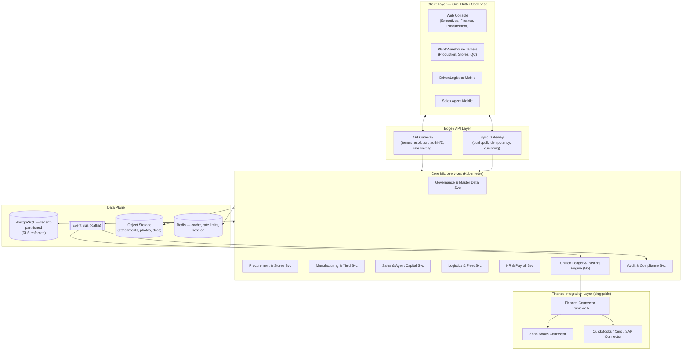
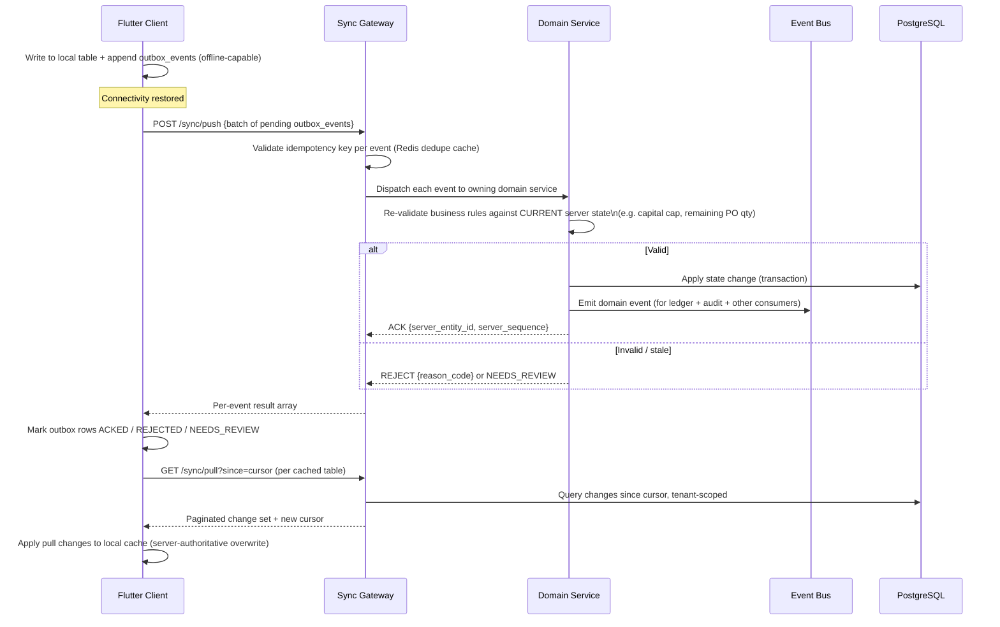
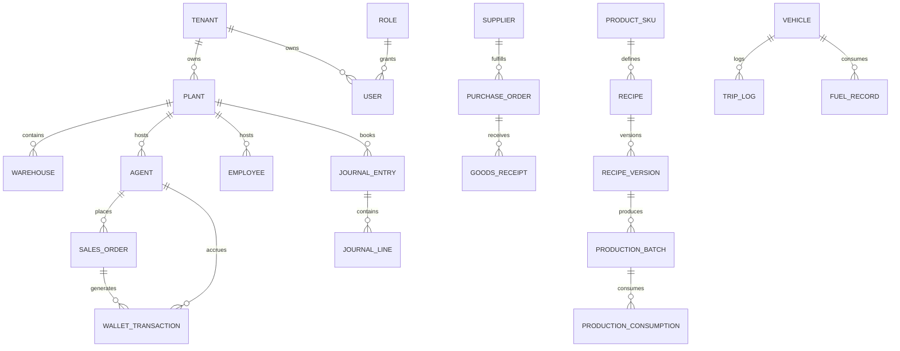

# System Design Documentation (SDD)
## Multi-Tenant ERP Platform for Food Manufacturing Enterprises
### Reference Tenant: Metrock Enterprises

**Document Class:** Engineering Handoff — Production-Ready System Design
**Version:** 1.0
**Status:** Draft for Engineering Review

---

## 0. Document Control & Relationship to Prior Artefacts

> **Governance Note.** Metrock Enterprises has an existing **Product Requirements Document (PRD)**, **Functional Requirements Specification (FRS)**, and **ERP Master Module Register / Table & Database Schema Register** scoped against a **single-tenant, Zoho Creator–centric implementation** (Zoho Creator as workflow engine; Zoho Books, Zoho Inventory, Zoho People, Zoho Payroll, Zoho Expense, Zoho Analytics as the surrounding system-of-record stack). This SDD **supersedes the platform choice**, not the functional scope. Every module, entity, field, and workflow captured in the existing 15-module register is preserved and carried forward — it has simply been re-platformed from a low-code single-tenant tool onto a custom-built, multi-tenant, offline-first, cross-platform engineering stack, per architectural direction confirmed for this build. Metrock becomes **Tenant Zero** of a productized platform intended for resale to other food-manufacturing enterprises.
>
> Where a table, field, or workflow in this document has a direct ancestor in the existing schema register (e.g. `plants`, `agent_master`, `trading_capital_ledger`, `integration_queue`), the original name is preserved and only extended (typically with `tenant_id` and generalized external-system fields) so that data migration from any pilot Zoho-based build remains a mechanical, traceable exercise. See **§5 Traceability Appendix**.

---

## 1. Executive Summary & Architectural Overview

### 1.1 System Topology

The platform is a **single cross-platform application codebase** (Flutter) serving four operational surfaces, backed by a **cloud-native microservices core** and a **pluggable finance integration layer**:



**Layer responsibilities:**

| Layer | Responsibility |
|---|---|
| Client Layer | Renders role-scoped UI, owns local encrypted SQLite store, queues offline mutations, resolves tenant context at launch |
| API Gateway | Tenant resolution (subdomain/header/token claim), authentication, coarse-grained authorization, rate limiting per tenant tier |
| Sync Gateway | Dedicated idempotent push/pull endpoints, cursor management, conflict adjudication hooks (see §2) |
| Core Microservices | Domain logic, approval-matrix enforcement, business validation, emits domain events |
| Event Bus (Kafka) | Durable, ordered, replayable transport for all domain + financial events; backbone for both sync and accounting |
| Unified Ledger | Tenant-scoped double-entry engine; the **system of record for financial truth**, independent of any external accounting product |
| Finance Connector Framework | Translates posted journal entries into tenant-configured external system calls (Zoho Books by default for Metrock; QuickBooks/Xero/SAP for other tenants) |
| Audit Service | Consumes every domain event to build the immutable, hash-chained audit trail (§4.2) |

### 1.2 Multi-Tenancy Model

**Chosen model: Hybrid "Pool-with-Silo-Option"** (shared infrastructure by default, dedicated isolation available per tenant tier) — not pure shared-schema, not pure database-per-tenant. Rationale: a pure shared-database model under-serves large tenants with data-residency/compliance demands; pure database-per-tenant is operationally unaffordable at small-tenant scale and defeats the economics of a SaaS rollout.

| Isolation Tier | Data Layer | Compute Layer | UI Layer | Target Tenant Profile |
|---|---|---|---|---|
| **Standard (Pool)** | Shared PostgreSQL cluster, shared schema, every table carries `tenant_id`; PostgreSQL **Row-Level Security (RLS)** policies enforce `tenant_id = current_setting('app.tenant_id')` on every query | Shared Kubernetes namespace, shared service pods, tenant context propagated via signed JWT claim → DB session variable per request | Tenant-specific theming/branding/feature flags resolved at login via `tenant_registry` | Small/medium food manufacturers (default for new tenants) |
| **Dedicated Schema (Bridge)** | Same cluster, tenant gets its own PostgreSQL schema (`tenant_<id>.*`), same table DDL, no RLS dependency for isolation | Same shared compute, connection pool routes by schema | Same as Standard | Mid-size tenants needing stronger isolation without full infra duplication |
| **Silo** | Dedicated PostgreSQL instance (or Aurora cluster) per tenant | Dedicated Kubernetes namespace / node pool, dedicated Kafka topic prefix | Same codebase, tenant-specific deployment config | Large enterprise tenants (e.g. Metrock at scale) with regulatory/data-residency requirements |

> **Critical constraint.** Tenant isolation is enforced **redundantly at three layers**, not one: (1) application-layer repository pattern rejects any query without an explicit `tenant_id` filter at compile time (lint rule + code-gen), (2) PostgreSQL RLS as a database-level backstop against application bugs, (3) API Gateway rejects any JWT whose tenant claim doesn't match the resolved tenant subdomain/header. No single-layer failure should be able to leak cross-tenant data.

**Identity & tenant provisioning:**

- Identity provider: **Keycloak** (self-hosted, open-source) — supports per-tenant realms or a shared realm with a `tenant_id` custom claim; free of per-MAU licensing costs that punish a multi-tenant reseller model; supports the `mfa_enabled` requirement already present in the `users` table.
- Tenant discovery: client resolves tenant by subdomain (`metrock.<platform>.app`) or a QR/invite-code flow for mobile-first onboarding (drivers/agents rarely type URLs); gateway maps subdomain → `tenant_id` → isolation tier → connection routing.
- Provisioning workflow (automated, Terraform + a provisioning microservice):
  1. Platform admin creates tenant record in `tenant_registry` (tenant code, name, isolation tier, region, default currency, default chart-of-accounts template).
  2. Provisioning service creates schema/instance per isolation tier, runs baseline migrations, seeds default `roles`, `approval_matrix` templates, `reason_codes`, and a starter `chart_of_accounts` (food-manufacturing template).
  3. Keycloak realm/tenant claim configured; first Tenant Admin invited.
  4. Finance connector selected and credentials vaulted (e.g. Zoho Books OAuth for Metrock) — connector is optional; tenant can run on the internal Unified Ledger alone.
  5. Tenant appears in platform status dashboard; SLA/tier metadata attached for billing.

### 1.3 Tech Stack Recommendations

| Concern | Recommendation | Why |
|---|---|---|
| **Frontend (cross-platform)** | **Flutter** + **BLoC** (Cubit for simpler screens) + `go_router` | Single Dart codebase spans iOS, Android, Web, and Desktop with genuinely shared business logic (not just shared UI) — important because approval-matrix and capital-eligibility logic must behave identically offline on a driver's phone and online in the web console. BLoC's unidirectional event→state model maps cleanly onto the offline outbox pattern (§2). |
| **Local device cache** | **Drift** (SQLite wrapper for Dart/Flutter, WASM-backed on Web) for relational transactional data; **Hive** for lightweight KV (session, feature flags, last-sync cursors) | Domain data (sales orders, order lines, capital ledgers, GRNs) is inherently relational with foreign keys and needs indexed range queries offline — SQLite via Drift outperforms document-style stores (Hive/WatermelonDB alone) for this. Hive is retained only for small non-relational config/state. |
| **Backend services** | **Go** for the Unified Ledger & Posting Engine and the Sync Gateway (concurrency-safe, deterministic, low-latency financial posting); **Node.js/NestJS (TypeScript)** for domain CRUD/workflow services (Governance, Procurement, Manufacturing, Sales, Fleet, HR) — fast iteration, OpenAPI-first, shares DTO types with Flutter via code generation; **Python (FastAPI)** reserved for the Analytics/Yield-Forecasting service only | Matches each workload to the language's strength rather than forcing one runtime everywhere; Go's concurrency model is specifically valuable for the ledger, which must serialize concurrent postings against the same account without lock contention blowing up under load. |
| **Event backbone** | **Apache Kafka** (or managed equivalent — Confluent Cloud / AWS MSK) | Durable, replayable, ordered-per-partition log is the natural substrate for both event-sourced accounting and the offline sync outbox; partitioned by `tenant_id` for isolation and throughput. |
| **Primary datastore** | **PostgreSQL** (Aurora PostgreSQL or Cloud SQL) with **Row-Level Security** | Strong relational integrity for approval matrices, ledgers, recipe versioning; RLS gives tenant isolation without per-tenant schema sprawl at the Standard tier. |
| **Cache / session / rate-limit** | **Redis** | Session state, idempotency-key short-term cache, capital-eligibility hot-path cache (with server-authoritative re-check, see §2.3 scenario 7). |
| **Object storage** | S3-compatible (AWS S3 / MinIO for self-hosted tenants) | GRN photos, batch photos, driver trip evidence, signed delivery notes — all captured offline and queued for background upload. |
| **Container orchestration** | Kubernetes (EKS/GKE), namespace-per-silo-tenant, shared namespace for Pool tier | Matches the tiered isolation model in §1.2. |
| **IaC** | Terraform + Helm | Tenant provisioning is code, not a runbook. |
| **Identity** | Keycloak (OIDC/OAuth2), tenant-aware realms | See §1.2. |
| **Observability** | OpenTelemetry → Grafana/Loki/Tempo stack | Every trace tagged with `tenant_id` for per-tenant SLA reporting. |
| **CI/CD** | GitHub Actions → progressive tenant rollout (canary tenant → cohort → all) | Multi-tenant SaaS must never deploy to all tenants simultaneously; staged rollout limits blast radius. |

---

## 2. Offline-First Sync Engine Architecture

> **Design stance.** Financial and inventory truth is too consequential for opportunistic CRDTs or naive last-writer-wins on whole records. The engine therefore uses **event-sourced, intent-based synchronization**: devices never sync "current state," they sync **immutable event intents**; the server is the sole authority that turns intents into truth, deterministically and idempotently. CRDT-style commutativity is used only where it is safe (append-only ledgers, counters), never for authoritative state like order status or capital caps.

### 2.1 Local Data Layer

Each client role caches only the subset of master + transactional data relevant to it (a **partial replica**, not a full mirror):

| Client Role | Cached Master Data | Cached Transactional Data | Local-Only Tables |
|---|---|---|---|
| Plant/Warehouse Tablet | `plants`, `warehouses`, `product_skus`, `recipe_versions`, `recipe_ingredients`, `suppliers` | `purchase_orders`, `goods_receipts` (draft + recent), `production_batches`, `production_consumption` | `outbox_events`, `sync_cursor` |
| Sales Agent Mobile | `agent_master` (self), `product_skus`, price lists | `sales_orders`, `order_lines`, `trading_capital_ledger` (read replica, last 90 days), `ncr_collections` (self) | `outbox_events`, `sync_cursor`, `capital_snapshot_cache` |
| Driver / Logistics Mobile | `vehicles` (assigned), `drivers` (self) | `trip_logs`, `fuel_records`, `plant_transfer_order_header/lines` (assigned) | `outbox_events`, `sync_cursor` |
| Web Console (Finance/Exec) | Full master data (online-first; minimal offline cache, mainly for resilience during brief drops) | Read-mostly; posting actions require connectivity | `sync_cursor` |

Local schema mirrors server table DDL exactly (same column names/types) so that the sync layer never needs a translation map — this is why Drift/SQLite (not a document store) was chosen for relational parity with PostgreSQL.

**`outbox_events`** (the core local artifact — every offline mutation becomes a row here, never a direct table edit that's "hoped" to sync later):

| Field | Type | Purpose |
|---|---|---|
| `client_event_id` | UUID (ULID) | Client-generated, globally unique, doubles as the idempotency key |
| `tenant_id` | UUID | Redundant local copy for defense-in-depth |
| `device_id` | UUID | Stable per-install identifier |
| `entity_type` | text | e.g. `sales_order`, `goods_receipt`, `production_batch` |
| `entity_id` | UUID | Local or server-issued entity primary key |
| `operation` | enum | `CREATE`, `UPDATE`, `STATUS_TRANSITION`, `LINE_ADD`, `LINE_ADJUST` |
| `payload_json` | jsonb | Full intent payload (not a diff — see rationale below) |
| `hlc_timestamp` | text | Hybrid Logical Clock stamp for causal ordering |
| `sync_status` | enum | `PENDING`, `IN_FLIGHT`, `ACKED`, `REJECTED`, `NEEDS_REVIEW` |
| `retry_count` | int | Exponential backoff driver |
| `server_response_json` | jsonb | Ack/conflict detail once returned |

Payloads are **full intents**, not field diffs, because diffs require a shared base state that offline devices cannot guarantee is current — an intent ("record acceptance of 480kg flour against PO-line X") is self-describing and safely replayable even if the server's view of the PO has moved on, whereas a diff against a stale base is not.

### 2.2 Synchronization Protocol

**Queue-based HTTP retry with idempotent endpoints**, not raw CRDT merge, is the transport pattern — chosen because it composes cleanly with Kafka-backed event sourcing already used for accounting (§3), and because idempotency keys give exactly-once semantics without requiring commutative data types everywhere.



Key protocol properties:

- **Idempotency**: `client_event_id` is a unique constraint at the ingestion table; a retried push (network flake after the server already committed) is a no-op ack, not a duplicate.
- **Push is intent-application, pull is state-replication**: pushes never contain "current balances," only actions; pulls always contain authoritative current state and simply overwrite the local cache — this asymmetry is what prevents local caches from silently drifting into stale truth for anything server-computed (running balances, approval status).
- **Cursor-based pull**: server assigns a monotonic per-tenant `sync_sequence` on every mutation; client persists `last_synced_cursor` per cached table; this makes pull resumable and bounded regardless of offline duration.
- **Backoff**: exponential retry (1s → 2s → 4s … capped, jittered) per outbox row; a device offline for days replays its full outbox on reconnect without server-side special-casing.
- **Batching & ordering**: events for the same `entity_id` are pushed in local `hlc_timestamp` order within a batch so the server never processes a `STATUS_TRANSITION` before the `CREATE` it depends on.

### 2.3 Conflict Resolution Matrix

| # | Scenario | Data Domain | Conflict Class | Resolution Strategy | Rationale |
|---|---|---|---|---|---|
| 1 | Two devices edit the same `sales_orders` header offline (e.g. agent edits quantity, supervisor overrides discount) | Sales | Field-level concurrent edit | Field-level Last-Writer-Wins keyed by `hlc_timestamp`; header **status** resolved by state-machine precedence (`CANCELLED` > `FULFILLED` > `APPROVED` > `DRAFT`), never by timestamp alone | Prevents a stale "draft" write from silently reopening an already-approved order |
| 2 | Local wallet debit (`trading_capital_ledger` entry from an offline sale) vs. an online NCR credit posting to the same agent, concurrently | Sales / Finance | Concurrent append, not a true conflict | Ledger is **append-only**; both entries are appended, `running_balance` is **never trusted from the client** and is recomputed server-side by full ledger replay (or incremental materialized balance under a serializable transaction) | Money must never be resolved by "pick a winner" — both facts are true and must both be recorded |
| 3 | Offline GRN acceptance recorded against a PO line that was already fully received online (double-receipt risk) | Procurement | Stale-base write | Idempotent by `(po_line_id, client_event_id)`; server validates `received_qty + accepted_qty ≤ ordered_qty` **at ingestion time**, not at capture time; over-receipt is routed to a **Variance Review** queue tagged with a `reason_code`, not silently rejected or silently accepted | Preserves goods-receipt evidence for audit even when it can't be auto-posted |
| 4 | Production batch output pushed twice due to app resync after a crash | Manufacturing | Duplicate delivery | Idempotency key = `batch_id + client_event_id`; duplicate push is a no-op ack | Exactly-once application under at-least-once transport |
| 5 | `recipe_versions` revised centrally while a batch was created offline against the prior version | Manufacturing | Master-data drift | Batches **snapshot-pin** `recipe_version_id` at creation; never live-reference the "current" version | Yield calculations must be reproducible against the recipe that was actually in effect, not whatever is current at sync time |
| 6 | Two plants offline-allocate the same finished-goods pallet to different `plant_transfer_order` destinations | Inter-Plant Logistics | True write-write conflict on a scarce resource | Optimistic concurrency: inventory balance row carries a `version`/row-hash; first sync to arrive wins and decrements stock; the second is rejected with `STALE_INVENTORY_STATE` and the client must re-fetch and re-submit against current availability | Physical stock cannot be double-allocated; this is the one class where "reject and retry" is correct, not merge |
| 7 | Agent's cached "available trading capital" is stale (finance changed the cap while the agent was offline) | Sales / Agent Capital | Stale authorization data | Local capital check is **advisory only** (soft UX gate to avoid the agent writing an order that will obviously fail); the **hard block is always re-evaluated server-side at sync time** against the authoritative `agent_capital_profile` | This is the single most important rule in the matrix: *"Order Volume > Available Capital → Block"* must be enforced where the truth lives, not where the cache lives |
| 8 | Two devices record attendance clock-in for the same employee within the same shift window | HR | Duplicate event | Dedupe by `(employee_id, event_type, time_bucket)` hash | Prevents double-counted attendance from a phone + a plant kiosk both registering the same event |
| 9 | Vehicle `fuel_records` submitted offline reference a `trip_log` that was cancelled online in the meantime | Fleet | Referential drift | Fuel record is still accepted and posted (fuel was physically purchased); it is auto-flagged `orphaned_trip_reference` for supervisor review rather than rejected | Never lose a real expense record over a referential race condition |

---

## 3. Integrated Module Designs & Financial Mappings

Every module below follows the same three-part structure: **Data Models** (tenant-partitioned, extending the existing schema register), **Offline Strategy** (which client roles touch it and how §2 applies), and **Financial Trigger** (the domain event → journal posting mapping enforced by the Unified Ledger's Posting Rule Engine).

> **Posting Rule Engine.** Every domain service emits a typed event (e.g. `grn.posted.v1`) to Kafka. The Ledger service consumes these via a per-tenant, per-event-type **Posting Rule** (`posting_rules` table: `event_type → debit_account_code, credit_account_code, amount_expression, condition_expression`), producing a `journal_entries` + `journal_lines` pair. This makes the Dr/Cr mappings **configurable per tenant's chart of accounts**, not hard-coded, while the event contracts themselves are fixed across all tenants.

### A. Governance & Master Data Module

**Data Models** (extends existing `plants`, `warehouses`, `departments`, `roles`, `users`, `approval_matrix`, `reason_codes`, `audit_log` — every table gains `tenant_id` as a mandatory, RLS-enforced leading column):

| Table | Key Fields Added for Multi-Tenant Platform | Notes |
|---|---|---|
| `tenant_registry` | `tenant_id` (PK), `tenant_code`, `tenant_name`, `isolation_tier`, `region`, `default_currency`, `finance_connector_type`, `provisioned_at`, `status` | New table — root of the tenant hierarchy |
| `plants` | `tenant_id`, *(existing: `plant_id`, `plant_code`, `plant_type`, `plant_role`, `capacity_kg_per_day`, `supports_agent_sales`, `supports_production`, `supports_interplant_transfer` …)* | Composite uniqueness: `(tenant_id, plant_code)` |
| `roles` | `tenant_id`, *(existing: `role_id`, `can_approve`, `can_post`, `can_override`)* | Role templates seeded at provisioning, tenant-customizable |
| `users` | `tenant_id`, *(existing fields)*, `keycloak_subject_id`, `mfa_enabled` | Auth identity lives in Keycloak; this is the domain profile |
| `approval_matrix` | `tenant_id`, *(existing: `threshold_min/max`, `approval_level_1..3_role_id`)* | Threshold currency normalized to `tenant_registry.default_currency` |
| `audit_log` | `tenant_id`, *(existing fields)* + `prev_hash`, `record_hash` | See §4.2 for hash-chaining |

**Offline Strategy:** Master data (`plants`, `warehouses`, `roles`, `approval_matrix`, `reason_codes`) is **pull-only, read-cached** on every client role — never edited offline. This is a deliberate simplification: governance data changes rarely and its correctness is safety-critical, so it is excluded from the offline-write surface entirely.

**Financial Trigger:** None directly — this module supplies the **control plane** (RBAC, approval routing, audit) consumed by every financially-triggering module below.

### B. Supply Chain, Procurement & Stores

**Data Models** (extends `suppliers`, `purchase_requests`, `purchase_request_lines`, `purchase_orders`, `purchase_order_lines`, `goods_receipts`, `goods_receipt_lines`):

- `purchase_requests`: `tenant_id`, `pr_id`, `plant_id`, `requesting_department`, `request_status`, `approval_status`, `current_approval_stage`, `pending_approver_role_id`
- `purchase_orders`: `tenant_id`, `po_id`, `supplier_id`, `linked_pr_id`, `po_status`, `approval_status`, `total_po_value`, `currency`
- `goods_receipts` / `goods_receipt_lines`: `tenant_id`, `grn_id`, `po_id`, `warehouse_id`, `qc_status`, `accepted_qty`, `rejected_qty`, `accepted_value`, `posting_status`

**Workflow:** `Purchase Request → Department Head Approval → Purchase Order (auto-generated from approved PR) → Supplier Fulfillment → Goods Receipt (GRN) → Inventory Posting → Ledger Posting`.

**Offline Strategy:** GRN capture is the primary offline surface — plant/warehouse tablets frequently sit in low-connectivity receiving bays. GRN creation, line-level accept/reject quantities, and photo evidence (uploaded via background queue to object storage) are all writable offline via `outbox_events`. Purchase Requests and Purchase Orders are online-preferred (approval workflows need real-time visibility) but degrade gracefully to offline draft + queued submission. Conflict handling follows **Matrix Scenario #3** (over-receipt validated server-side at ingestion, not capture).

**Financial Trigger:**

| Event | Debit | Credit | Amount |
|---|---|---|---|
| `grn.posted.v1` (accepted line) | Raw Material Inventory (WIP-eligible asset account, per SKU category) | Accounts Payable (supplier sub-ledger) | `accepted_qty × unit_cost` |
| `grn.rejected_line.v1` | *(no financial posting — rejected quantity never enters inventory)* | — | Logged to `reason_codes`-tagged variance report only |

```
Dr  Raw Material Inventory — Flour        480,000
    Cr  Accounts Payable — Supplier X                  480,000
    (GRN-2026-00417, PO-2026-00312, Warehouse WH-PLT1-RM)
```

### C. Manufacturing & Yield Intelligence

**Data Models** (extends `product_skus`, `recipes`, `recipe_versions`, `recipe_ingredients`, `production_batches`, `production_consumption`):

- `recipe_versions`: `tenant_id`, `recipe_version_id`, `standard_batch_size`, `standard_yield_qty`, `standard_cost`, `approval_status` (`approved_by_lab`, `approved_by_finance`, `approved_by_executive` — a three-way sign-off before a version is postable)
- `production_batches`: `tenant_id`, `batch_id`, `plant_id`, `sku_id`, `recipe_version_id` **(snapshot-pinned, immutable once batch starts — Matrix Scenario #5)**, `planned_qty`, `actual_output_qty`, `actual_waste_qty`, `batch_status`
- `production_consumption`: `tenant_id`, `consumption_id`, `batch_id`, `ingredient_sku_id`, `planned_qty`, `actual_qty`, `variance_qty`

**Yield Calculation:**

$$
\text{Yield \%} = \frac{\text{Output Quantity}}{\text{Input Quantity}} \times 100
$$

Applied at batch close: `actual_output_qty / Σ(production_consumption.actual_qty)`. A configurable **yield threshold** per SKU (stored on `recipe_versions`) triggers an automated exception alert (routed to the Manufacturing Supervisor role and logged with a `reason_code`) when actual yield falls below standard — this is a monitoring workflow, **not** an automatic financial adjustment; yield variance is investigated before it is costed.

**Recycling Workflow:** Waste/rework quantities (`actual_waste_qty`) that are reclaimable feed a `recycling_batches` linkage back into `production_consumption` as a discounted-cost input on a subsequent batch, preserving full genealogy (a recycled-input batch can trace its cost lineage back through the original batch it was reclaimed from) — required for food-safety traceability audits, not just cost accounting.

**Offline Strategy:** Plant-floor batch logging (mixing start/end, output weigh-in, waste recording) is the highest-frequency offline write surface in the whole platform — production floors are frequently the worst-connectivity zones. `production_batches` and `production_consumption` writes use the full outbox/idempotency pattern (**Matrix Scenario #4**); recipe/SKU master data is pull-only cached.

**Financial Trigger:**

| Event | Debit | Credit | Amount |
|---|---|---|---|
| `batch.consumption_recorded.v1` | Work-in-Progress (WIP) — Batch `{batch_id}` | Raw Material Inventory | `Σ(actual_qty × recipe_ingredients.unit_cost)` |
| `batch.output_recorded.v1` | Finished Goods Inventory — SKU `{sku_id}` | Work-in-Progress (WIP) — Batch `{batch_id}` | `actual_output_qty × standard_cost` (standard costing; variance below) |
| `batch.yield_variance_closed.v1` | Manufacturing Variance Expense *(if unfavorable)* | Work-in-Progress (WIP) | `WIP balance remaining after FG transfer` (favorable variance posts the reverse) |

```
Dr  Work-in-Progress — Batch BR-2026-08841        612,400
    Cr  Raw Material Inventory                                612,400

Dr  Finished Goods Inventory — SKU BRD-500G       590,000
Dr  Manufacturing Variance Expense (unfavorable)   22,400
    Cr  Work-in-Progress — Batch BR-2026-08841                612,400
```

### D. Sales & Agent Capital Governance

**Data Models** (extends `agent_master`, `agent_capital_profile`, `sales_orders`, `order_lines`, `ncr_collections`, `trading_capital_ledger`, `performance_reward_ledger`):

- `agent_master`: `tenant_id`, `agent_id`, `approved_trading_capital`, `capital_cap`, `weekly_target`, `base_discount_percent`
- `agent_capital_profile`: `tenant_id`, `trading_capital`, `capital_ceiling`, `capital_status`, `risk_buffer_percent`
- `sales_orders`: `tenant_id`, `sales_order_id`, `agent_id`, `credit_eligibility_status`, `total_order_value`, `order_status`
- `trading_capital_ledger`: `tenant_id`, `tcl_entry_id`, `entry_type`, `debit_value`, `credit_value`, `running_balance` *(server-computed only, never client-writable)*

**Capital Eligibility Rule (hard gate, server-authoritative — see Matrix Scenario #7):**

$$
\text{Order Approved} \iff \big(\text{Available Capital} = \text{approved\_trading\_capital} - \sum \text{outstanding order exposure}\big) \geq \text{Order Volume}
$$

> **Governance constraint.** This check is re-evaluated at three points: (1) client-side soft-check for UX only, (2) at `sales_orders` creation on the server, (3) again at sync-time reconciliation if the order was created offline. Any of the three failing **blocks or escalates** the transaction — it is never auto-approved on the strength of a stale client-side check alone.

**Offline Strategy:** Sales order capture and NCR (cash collection) submission are core offline surfaces for field agents. Orders created offline carry a **provisional `credit_eligibility_status = PENDING_SYNC_VALIDATION`** and are not treated as confirmed/fulfillable stock commitments until the server re-validates capital at sync time; if the re-check fails, the order is auto-routed to `NEEDS_REVIEW` (Matrix Scenario #7) rather than silently cancelled, so the agent doesn't lose the sale outright — a supervisor can approve an override with a `reason_code`.

**Financial Trigger:**

| Event | Debit | Credit | Amount |
|---|---|---|---|
| `sales.order_fulfilled.v1` | Agent Wallet Ledger (`trading_capital_ledger`, `entry_type = DEBIT_EXPOSURE`) | Sales Revenue | `total_order_value` |
| `ncr.verified.v1` | Cash/Bank | Agent Wallet Ledger (`entry_type = CREDIT_RECOVERY`) | `ncr_collections.amount` |
| `performance.reward_posted.v1` | Sales Incentive Expense | Cash/Bank Accrual (or Agent Wallet, per `destination_account`) | `performance_reward_ledger.total_reward` |

```
Dr  Agent Wallet Ledger — Agent AG-0231            185,000
    Cr  Sales Revenue                                          185,000
    (SO-2026-19042, fulfilled at Plant PLT-3)
```

### E. Logistics, Fleet & Fuel Management

**Data Models** (extends `vehicles`, `drivers`, `vehicle_assignments`, `trip_logs`, `fuel_records`, `vehicle_maintenance`):

- `vehicles`: `tenant_id`, `vehicle_id`, `service_threshold_km`, `current_mileage`, `assigned_driver_id`
- `trip_logs`: `tenant_id`, `trip_log_id`, `start_mileage`, `end_mileage`, `trip_status`
- `fuel_records`: `tenant_id`, `fuel_record_id`, `litres`, `fuel_cost`, `expense_claim_reference`

**Fuel Variance:**

$$
\text{Fuel Variance} = \text{Expected Fuel Consumption} - \text{Actual Fuel Consumption}
$$

where Expected Fuel Consumption is derived from a per-vehicle-class consumption norm (`litres per km`, configurable master data) applied to `trip_logs.end_mileage − start_mileage`. Variance beyond a configurable tolerance band auto-creates a `maintenance_requests` entry (possible mechanical cause) **and/or** flags the trip for a fuel-diversion investigation (possible fraud) — the platform deliberately routes both possibilities into the same review queue rather than assuming one root cause.

**Offline Strategy:** Trip logs and fuel records are the canonical offline-capture use case named in the mandate — drivers are frequently in zero-connectivity transit corridors. Both use the standard outbox pattern; **Matrix Scenario #9** governs the case where a fuel record references a trip that was cancelled/edited in the interim.

**Financial Trigger:**

| Event | Debit | Credit | Amount |
|---|---|---|---|
| `fleet.fuel_recorded.v1` | Vehicle Fuel Expense (per plant/cost-center) | Cash/Fuel Card Payable, or Employee Expense Payable if reimbursed | `fuel_cost` |
| `fleet.maintenance_completed.v1` | Vehicle Maintenance Expense | Accounts Payable / Cash | `parts_cost + labour_cost` |

> Note: **fuel variance itself is an operational KPI, not a direct journal posting** — only actual fuel cost is posted financially. Fabricating a monetary "variance entry" without an underlying transaction would corrupt the ledger; variance instead drives the maintenance/investigation workflow above.

### F. HR & Revenue-Based Payroll

**Data Models** (extends `employees`, `attendance_logs`, `leave_requests`, `salary_structures`, `payroll_runs`, `payroll_records`):

- `payroll_runs`: `tenant_id`, `payroll_run_id`, `payroll_period`, `payroll_status`, `posted_to_books_flag`
- `payroll_records`: `tenant_id`, `payroll_record_id`, `employee_id`, `gross_salary`, `total_deductions`, `net_salary`

**Revenue-Based Payroll Pool Calculation:**

$$
\text{Payroll Pool} = \text{Plant Revenue} \times \text{Payroll Ratio}
$$
$$
\text{Employee Salary} = \text{Payroll Pool} \times \text{Grade Weight}_{\text{employee}}
$$

Plant Revenue is pulled from confirmed `sales_orders`/`journal_entries` for the payroll period at the employee's assigned plant; `Payroll Ratio` and `Grade Weight` are tenant-configurable master data (per plant, per grade), giving each tenant its own compensation policy without code changes.

**Offline Strategy:** Attendance clock-in/out is the only meaningfully offline-relevant surface in this module (plant-floor kiosks/phones); the payroll calculation and run itself is an online-only, finance-gated batch process (never executed offline, never eligible for offline queuing) given its downstream financial and legal weight. Attendance dedupe follows **Matrix Scenario #8**.

**Financial Trigger:**

| Event | Debit | Credit | Amount |
|---|---|---|---|
| `payroll.run_posted.v1` | Salary/Wages Expense (per plant/department cost-center) | Cash/Bank Accruals (Payroll Payable) | `Σ payroll_records.net_salary` for the run |

```
Dr  Salary/Wages Expense — Plant PLT-1        4,210,000
    Cr  Payroll Payable (Cash/Bank Accrual)                4,210,000
    (Payroll Run PR-2026-07, posted_to_books_flag = TRUE)
```

---

## 4. Data Modeling & Security

### 4.1 Core ERD Mapping

Tenant partitioning is universal — every entity below carries `tenant_id` as its first column and every foreign key is implicitly scoped to the same tenant (enforced by a composite FK constraint `(tenant_id, referenced_id)` where PostgreSQL allows it, or an application-level invariant check where it doesn't).



**Finance schema (new, extends the register beyond its original Zoho-Books-as-truth assumption):**

| Table | Key Fields | Purpose |
|---|---|---|
| `chart_of_accounts` | `tenant_id`, `account_code`, `account_name`, `account_type`, `parent_account_code` | Per-tenant COA, seeded from a food-manufacturing template |
| `posting_rules` | `tenant_id`, `event_type`, `debit_account_code`, `credit_account_code`, `amount_expression`, `condition_expression` | Configurable event→journal mapping (§3 preamble) |
| `journal_entries` | `tenant_id`, `journal_entry_id`, `source_event_id`, `source_module`, `posting_date`, `status` | Header — the Unified Ledger's system-of-record entry |
| `journal_lines` | `tenant_id`, `journal_entry_id`, `account_code`, `debit_amount`, `credit_amount`, `cost_center_plant_id` | Double-entry lines; `Σdebit = Σcredit` enforced by a DB check constraint |
| `integration_queue` *(existing, extended)* | `+tenant_id`, `+external_system` (`ZOHO_BOOKS`, `QUICKBOOKS`, …), *(existing: `source_module`, `payload_json`, `retry_count`, `posted_external_id`)* | Outbound sync from `journal_entries` to the tenant's configured external finance system |
| `failed_posting_review` *(existing, extended)* | `+tenant_id`, *(existing fields)* | Human-in-the-loop recovery queue for connector failures |

### 4.2 Security & Audit Logs

**Access control:** Role-based (`roles.can_approve`, `can_post`, `can_override`) combined with the `approval_matrix` threshold routing already defined in the register, now scoped per tenant. Posting authority (`can_post`) is required to transition any transaction into a state that emits a financial event — this is enforced in the domain service layer, not just the UI.

**Immutable audit trail:** Extends the existing `audit_log` table with **hash chaining** for tamper-evidence:

| Field | Purpose |
|---|---|
| `audit_log_id`, `event_time`, `user_id`, `module_name`, `record_id_ref`, `action_type`, `old_value_snapshot`, `new_value_snapshot`, `ip_or_device`, `override_flag`, `reason_code` *(existing)* | Base audit record |
| `prev_hash` | SHA-256 of the previous audit record in the same tenant's chain |
| `record_hash` | SHA-256 of this record's content + `prev_hash` |

Every write to a posted (non-draft) financial or inventory record is append-only at the domain layer — **no UPDATE or DELETE is permitted against `journal_entries`, `journal_lines`, `trading_capital_ledger`, or `audit_log` once posted**; corrections are always a new reversing entry, never a mutation, which is also why the hash chain is meaningful (nothing behind it can be silently altered).

> **Governance warning.** Any attempt to bypass posting-authority checks (e.g. a role without `can_post` invoking a posting endpoint directly) must itself be captured in `audit_log` with `override_flag = true` and a mandatory `reason_code`, and must raise a real-time alert to the tenant's Finance/Compliance role — an authorization bypass attempt is a security event whether or not it succeeds.

**Encryption & transport:** TLS 1.3 in transit; AES-256 at rest for PostgreSQL and object storage; local Drift/SQLite databases encrypted at rest via SQLCipher on all client platforms (critical since driver/agent devices are the most likely to be lost or stolen).

**Tenant-boundary testing:** Every release pipeline runs an automated cross-tenant leakage test suite (attempt to read/write Tenant B data using a Tenant A token) as a release gate, not an optional check.

---

## 5. Traceability Appendix — Mapping to Existing PRD / FRS / Module Register

| Existing Artefact Concept | Platform Realization in This SDD |
|---|---|
| Zoho Creator (operational workflow engine) | NestJS/Go domain microservices + Flutter client logic (BLoC) |
| Zoho Inventory (stock ledger) | PostgreSQL inventory tables (`goods_receipts`, `production_batches` outputs, `plant_transfer_order_*`), owned internally |
| Zoho Books (financial ledger) | Unified Ledger (`journal_entries`/`journal_lines`) as system of record; Zoho Books becomes an optional **downstream connector** via the Finance Connector Framework, preserving Metrock's existing integration expectation without making every tenant dependent on a Zoho subscription |
| Zoho People / Zoho Payroll | HR & Payroll domain service, same entities (`employees`, `payroll_runs`, `payroll_records`), revenue-based formula implemented natively rather than in a third-party payroll product |
| Zoho Analytics | OpenTelemetry/Grafana operational dashboards + a dedicated Analytics read-replica/warehouse for executive reporting |
| Zoho Flow (integration/orchestration) | Kafka event bus + Finance Connector Framework |
| Single-tenant assumption throughout PRD/FRS | Every table gains `tenant_id`; `tenant_registry` added as new root entity; RLS + schema/silo tiers added (§1.2) |
| `integration_queue` / `failed_posting_review` (already present in the register) | Retained verbatim, extended with `tenant_id` and `external_system` to generalize beyond a single Zoho org |

**Mandatory migration set** (unchanged in substance from the existing register, now migrated **per-tenant** into the new platform): `plants`, `warehouses`, `departments`, `roles`, `users`, `product_skus`, `recipes` + active `recipe_versions`, `suppliers`, `agent_master` + active `agent_capital_profile`, opening `trading_capital_ledger` balances, `employees`, `salary_structures`, `vehicles`, `drivers`, `equipment_register`, `maintenance_schedules`, `fixed_asset_operational_register`, `plant_supply_network`, `transfer_pricing_rules`, `approval_matrix`.

---

*End of System Design Documentation.*
